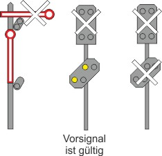

# Allgemeine Bestimmungen (301.0002)

---

# 1. Begriffsbestimmungen

Die Signale dürfen nur in den vorgeschriebenen Formen, Farben und Klangarten
und für den vorgesehenen Zweck verwendet werden.

## a) Signal

Ein Signal ist ein sichtbares oder hörbares Zeichen mit einer festgelegten
Information zur Gewährleistung des sicheren Bewegens von Eisenbahnfahrzeugen.

## b) Signalbegriff

Der Signalbegriff ist die Kurzbezeichnung eines Signals (z. B. Zs 1), die bei
einigen Signalen durch eine Langbezeichnung ergänzt ist (z. B. Ersatzsignal).

## c) Signalbedeutung

Die Signalbedeutung ist die verbale Darstellung der Information, die ein
Signal gibt.

## d) Signalbeschreibung

Die Signalbeschreibung ist die verbale Darstellung des Signalbildes oder
des Signaltones.

## e) Signalbild

Das Signalbild umfasst die für ein sichtbares Signal festgelegten Formen,
Farben und Merkmale (z. B. Symbole, Buchstaben, Zahlen).

Ein sichtbares Signal kann ein Formsignal, Lichtsignal oder ein Handsignal
sein.

## f) Signalton

Der Signalton umfasst das hörbare Signal, das aus einem oder mehreren
Tönen besteht, für die die Dauer und, wenn erforderlich, auch die Tonhöhe
festgelegt sind.

## g) Ortsfeste signaltechnische Einrichtungen

Abweichend von a) werden ortsfeste signaltechnische Einrichtungen, mit
denen Signale nach a) gegeben werden, allgemein als Signal bezeichnet.

Es gibt z. B.
- Hauptsignale,
- Vorsignale,
- Sperrsignale.

Sperrsignale zeigen an, ob in den folgenden Gleisabschnitt eingefahren
und in diesem rangiert werden darf oder ob eine Drehscheibe oder
Schiebebühne befahren werden darf.

Sperrsignale werden auch als Zugdeckungssignale an Bahnsteigen,
Brückendeckungssignale und Deckungssignale an Rückfallweichen angewendet.

---

# 2. Allgemeine Bestimmungen für Signale

## (1) Beschreibung der Signale

Für das Aussehen der Signale ist die Beschreibung maßgebend. Die Abbildungen
dienen zur Erläuterung.

## (2) Zeitweilig betrieblich abgeschaltete Signale

Signale, die zeitweilig betrieblich abgeschaltet sind, zeigen an Stelle der sonst
vorgesehenen Signalbilder ein weißes Licht (Kennlicht).

Das gilt nicht für das Signal Ne 13.

Bei den NE kann auf die Anwendung des Kennlichts verzichtet werden.

Ein Sperrsignal (Lichtsignal), das unmittelbar an einem Hauptsignal steht, ist
dunkel, wenn das Hauptsignal Fahrt zeigt oder an diesem das Signal Zs 1, Zs
7 oder Zs 8 gezeigt wird.

## (3) Standort der Signale

Ortsfeste Signale sowie die Langsamfahrsignale Lf 1, Lf 2 und Lf 3, das
Schutzhaltsignal Sh 2 und die Signale El 3, El 4 und El 5 befinden sich in der
Regel unmittelbar rechts – auf zweigleisigen Strecken für Fahrten entgegen
der gewöhnlichen Fahrtrichtung auf der freien Strecke unmittelbar links – neben
oder über dem Gleis, zu dem sie gehören.

Sind bei einzelnen Signalen abweichende Regeln zur Aufstellung erforderlich,
so sind diese bei dem betroffenen Signal gegeben.

Bei den Eisenbahnen des Bundes werden ständige und vorübergehende
Ausnahmen zu dieser Bestimmung durch den Infrastrukturunternehmer bekannt
gegeben.

Die Bezeichnungen rechts und links sind im Sinne der Fahrtrichtung zu verstehen.
Einfahrsignale befinden sich auf zweigleisigen Strecken für Fahrten entgegen
der gewöhnlichen Fahrtrichtung unmittelbar links neben oder über dem Gleis,
zu dem sie gehören.

### Örtliche Zusätze

Ständige Ausnahmen zu den Bestimmungen zu Signalstandorten werden im
Fahrplan oder in örtlichen Zusätzen bekannt gegeben.

Vorübergehende Ausnahmen oder Ausnahmen bei Bauzuständen werden in
der Zusammenstellung der vorübergehenden Langsamfahrstellen und anderen
Besonderheiten (La) bekannt gegeben.

---

# 3. Zuordnungstafel, (Signal So 20 [DV 301])

## (1)

Das durch die Zuordnungstafel gekennzeichnete Signal gilt für das Gleis, auf
das die Spitze des Dreiecks weist.

## (2)

Ein schwarzes Rechteck mit weißem Dreieck

## (3)

Das weiße Dreieck der Zuordnungstafel ist rückstrahlend.

Die Zuordnungstafel ist zu beleuchten, wenn auch das gekennzeichnete Signal
zu beleuchten ist.

Ein Signal ist durch die Zuordnungstafel gekennzeichnet, wenn es auf Grund
seines Standorts zwischen zwei Gleisen unzutreffend auch für das Nachbargleis
gültig sein würde.

## (4)

Die Zuordnungstafel wird in Verbindung mit folgenden Signalen angewandt:

- Signal Ts 1,
- Signale Lf 1, Lf 2, Lf 3, Lf 4, Lf 5, Lf 6 und Lf 7,
- Signale El 1v, El 1, El 2, El 3, El 4 und El 5,
- Signale Ne 1, Ne 2, Ne 3, Ne 4, Ne 5 und Ne 7,
- Signale Bü 0/1, Bü 4 und Bü 5,
- Signale Bü 2 und Bü 3 (jeweils DS 301),
- Signale So 1, So 14, So 15 und So 19 (jeweils DV 301),
- Signal Pf 2 (DV 301).

Sollen die Signale für beide Gleise gültig sein, sind sie durch zwei Zuordnungstafeln
zu kennzeichnen.

## (5)

Die Zuordnungstafel ist über dem zu kennzeichnenden Signal – bei Signalen
Bü 0/1 über dem Mastschild – angebracht.

Ist das durch Zuordnungstafel gekennzeichnete Signal zusätzlich durch einen
oder durch mehrere Richtungspfeile ergänzt, sind die Richtungspfeile unterhalb
des zu kennzeichnenden Signals angebracht.

---

# 4. Geschwindigskeitsänderungen

## (1) Niedrigere zulässige Geschwindigkeit

Eine durch ein Signal vorgegebene niedrigere zulässige Geschwindigkeit
muss erreicht sein, wenn der Zug oder die Rangierfahrt das Signal mit der
Spitze erreicht hat.

## (2) Höhere zulässige Geschwindigkeit

Eine durch ein Signal vorgegebene höhere zulässige Geschwindigkeit darf
gefahren werden, wenn ein Zug oder eine Rangierfahrt mit der gesamten
Länge an der Stelle vorbeigefahren ist, an der die Geschwindigkeit erhöht
werden darf.

## (3)

Bei einzelnen Signalen können abweichende Regeln gegeben sein.

---

# 5. Anschließender Weichenbereich

## (1)

Der anschließende Weichenbereich ist wie folgt begrenzt:

Der Anfang liegt an dem Signal, ab dem die Fahrt zugelassen wird.

Das Ende liegt

- bei einer Fahrt auf Einfahrsignal oder Zwischensignal am folgenden Hauptsignal
oder an einem etwa davor liegenden – bei mehreren, am letzten –
gewöhnlichen Halteplatz des Zuges,

- bei einer Fahrt auf Ausfahrsignal hinter der letzten Weiche im Fahrweg,
wenn keine Weiche vorhanden ist, am Ausfahrsignal,

- auf Abzweigstellen, Überleitstellen und auf Anschlussstellen mit Hauptsignal
hinter der letzten Weiche im Fahrweg.

## (2)

Ist am Ende eines anschließenden Weichenbereichs eine höhere Geschwindigkeit
zugelassen, darf die Geschwindigkeit erst dann erhöht werden, wenn
der Zug den anschließenden Weichenbereich vollständig verlassen hat. Dies
gilt nicht bei Halt am gewöhnlichen Halteplatz.

---

# 6. Nachtzeichen der Signale

## (1) Nachtzeichen der Formsignale

Die Nachtzeichen der Formsignale sind mit dem Eintritt der Dämmerung bis
zum Eintritt voller Tageshelle anzuwenden.

Bei unsichtigem Wetter sind die Nachtzeichen in jedem Fall so lange anzuwenden,
bis die Tageszeichen auf eine Entfernung von 100 m zweifelsfrei zu
erkennen sind.

Unabhängig davon ist es zulässig, auch in anderen Fällen die Nachtzeichen
insbesondere der Handsignale am Tage anzuwenden, wenn dadurch die Signalaufnahme
verbessert werden kann.

## (2) Nachtbeleuchtung der Lichtsignale

An Lichtsignalen ist während der Dunkelheit die Nachtbeleuchtung anzuwenden.

Bei unsichtigem Wetter ist – soweit möglich – stets die Tagesbeleuchtung anzuwenden.

---

# 7. Nicht deutlich wahrnehmbare oder zweifelhafte Signale

Wird im Einzelfall ein Signal nicht deutlich wahrgenommen oder ist es zweifelhaft,
muss die Bedeutung angenommen werden, die die größte Vorsicht erfordert.

---

# 8. Mastschilder

## (1) Mastschilder an Lichtsignalen

Lichtsignale, an deren Standort bei erloschenem Signalbild zu halten ist, sind
durch Mastschilder kenntlich.

Die Mastschilder geben das Verhalten bei Halt zeigenden oder gestörten
Lichtsignalen vor. Sie sind

- weiß-rot-weiß
    - bzw. ein mit der Spitze nach oben weisendes rotes Dreieck auf weißem
Grund (DV 301),
- weiß-gelb-weiß-gelb-weiß,
- rot (nur bei der Gleichstrom-S-Bahn Berlin),
- weiß-schwarz-weiß-schwarz-weiß
(nur bei den Gleichstrom-S-Bahnen Berlin und Hamburg) sowie
- weiß mit zwei schwarzen Punkten (DV 301).

### a) Weiß-rot-weißes Mastschild

An einem durch ein weiß-rot-weißes Mastschild

bzw. durch ein Mastschild mit einem mit der Spitze nach oben weisenden
roten Dreieck auf weißem Grund (DV 301)

gekennzeichneten Lichtsignal, das Halt zeigt oder gestört ist, dürfen Züge
nur auf Ersatzsignal, Vorsichtsignal, Gegengleisfahrt-Ersatzsignal, Befehl
oder – bei Signal Zs 12 – auf mündlichen bzw. fernmündlichen Auftrag vorbeifahren.

Rangierfahrten dürfen nur mit Zustimmung des zuständigen Wärters am
Signal vorbeifahren.

### b) Weiß-gelb-weiß-gelb-weißes Mastschild

An einem durch ein weiß-gelb-weiß-gelb-weißes Mastschild gekennzeichneten
Lichthauptsignal, das Halt zeigt oder gestört ist, dürfen Züge, wenn
nach dem Anhalten vor diesem Signal eine Verständigung mit dem Fahrdienstleiter
nicht möglich ist, ohne Zustimmung vorbeifahren und müssen
bis zum nächsten Hauptsignal auf Sicht fahren.

Hauptsignale mit diesem Mastschild besitzen im Geltungsbereich der
DV 301 zugleich eine Vorsignalfunktion.

### c) Weiß-schwarz-weiß-schwarz-weißes Mastschild

An einem durch ein weiß-schwarz-weiß-schwarz-weißes Mastschild gekennzeichneten
Lichthauptsignal, das Halt zeigt oder gestört ist, dürfen
Züge nach dem Anhalten vor diesem Signal ohne Zustimmung vorbeifahren
und müssen bis zum nächsten Hauptsignal auf Sicht fahren.

Hauptsignale mit diesem Mastschild besitzen zugleich eine Vorsignalfunktion.

### d) Rotes Mastschild

An einem durch ein rotes Mastschild gekennzeichneten Lichthauptsignal,
das Halt zeigt oder gestört ist, dürfen Züge nur auf Ersatzsignal, Gegengleisfahrt-
Ersatzsignal, Befehl oder – bei Signal Zs 12 – auf mündlichen
bzw. fernmündlichen Auftrag vorbeifahren.

Bis zum nächsten Hauptsignal ist auf Sicht zu fahren.

### e) Weißes Mastschild mit zwei schwarzen Punkten

An einem durch ein weißes Mastschild mit zwei schwarzen Punkten gekennzeichneten
Lichtsignal, das Halt zeigt, dürfen Züge nur auf Befehl vorbeifahren.

Ein mit diesem Mastschild gekennzeichnetes Signal, das Ra 12 (DV 301)
zeigt oder erloschen ist, hat für Züge keine Bedeutung.

## (2) Formhauptsignale

Die Maste der Formhauptsignale sind zur besseren Erkennbarkeit rot-weiß
gekennzeichnet.

Diese Kennzeichnung enthält keine Information.

---

# 9. Ungültige Signale

## (1) Kennzeichnung ungültiger Signale

Ein ungültiges Signal ist durch ein weißes Kreuz mit schwarzem Rand gekennzeichnet
oder es ist verdeckt.

Außerdem werden ungültige Formsignale bei Dunkelheit nicht beleuchtet, ungültige
Lichtsignale gelöscht.

Beispiele für die Kennzeichnung:

## (2)

Ist das Signal Lf 1 durch ein weißes Kreuz mit schwarzem Rand als ungültig
gekennzeichnet, sind die Signale Lf 2 und Lf 3 nicht aufgestellt oder verdeckt.
Die gelben Lichter leuchten während der Dunkelheit.

## (3)

Ist das Signal El 3 durch ein weißes Kreuz mit schwarzem
Rand als ungültig gekennzeichnet, sind die Signale El 4 und El 5 nicht aufgestellt
oder verdeckt. Es ist bei Dunkelheit beleuchtet.

