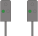

# Kombinationssignale (Ks) (301.0102)

---

# 1. Allgemeines

## (1)

Kombinationssignale sind Lichtsignale, die die Fahrtaufträge mit einem Signallicht
anzeigen.

Die Signale Ks 1 und Ks 2 gelten nur für Zugfahrten.

Die Signale können die Funktion

- eines Hauptsignals,
- eines Vorsignals oder
- eines Haupt- und Vorsignals

haben.

## (2) Hauptsignale mit Vorsignalfunktion

Hauptsignale, die mit weiß-rot-weißem Mastschild gekennzeichnet sind und
zugleich Vorsignalfunktion besitzen, sind zusätzlich mit folgendem Mastschild
gekennzeichnet:

Ein mit der Spitze nach unten weisendes gelbes Dreieck.

Das Mastschild ist rückstrahlend.

Das dreieckige gelbe Mastschild ist grundsätzlich unter dem weiß-rot-weißen
Mastschild angeordnet.

## (3) Verkürzter Abstand des Bremswegs

Kombinationssignale mit Vorsignalfunktion, die in einem um mehr als 5% verkürzten
Abstand des Bremswegs der Strecke vor dem zugehörigen Signal
stehen, zeigen bei Signal Ks 1 mit Zs 3v und bei Signal Ks 2 ein weißes Zusatzlicht
über dem Signallicht.

## (4) Vorsignalwiederholer

Vorsignalwiederholer zeigen bei Ks 1 mit Zs 3v und bei Ks 2 ein weißes Zusatzlicht
unter dem Signallicht.

---

# 2. Signal Ks 1

## (1) Bedeutung

**Fahrt**

## (2) Beschreibung

Ein grünes Licht bzw. ein grünes Blinklicht.

## (3) Grünes Blinklicht

Das Signal zeigt grünes Blinklicht, wenn an diesem Signal ein Signal Zs 3v
gezeigt wird.

## (4) Geschwindigkeit

Das an einem Hauptsignal gezeigte Signal erlaubt die Anwendung der im
Fahrplan zugelassenen Geschwindigkeit.

---

# 3. Signal Ks 2

## (1) Bedeutung

**Halt erwarten.**

## (2) Beschreibung

Ein gelbes Licht.

## (3)

Das Signal erlaubt die Vorbeifahrt und kündigt Halt an.
