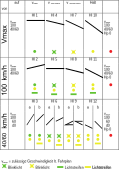

# Lichthaupt- und Lichtvorsignale (Hl) (DV 301) (301.0103)

---

# 1. Allgemeines

## (1) Aussehen

Die Lichthaupt- und Lichtvorsignale bestehen aus bei Tag und bei Dunkelheit
leuchtenden Lampen, die an einem Signalschirm angebracht sind.

Hinsichtlich der Kennzeichnung der Lichthauptsignale durch Mastschilder wird
auch auf Richtlinie 301.0002 Abschnitt 8 und Richtlinie 301.1401 Abschnitt 2
Absätze 12 und 13 verwiesen.

## (2)

Fahrtbegriffe an Hl-Signalen gelten nur für Zugfahrten.

## (3) Hl-Signal mit einem Licht

Ein Lichthaupt- oder Lichtvorsignal mit einem Licht zeigt an, dass die im Fahrplan
zugelassene Geschwindigkeit entweder beibehalten werden darf (ein
grünes Standlicht) oder so vermindert werden muss, dass die vorangezeigte
Geschwindigkeit am nächsten Signal nicht überschritten wird (ein grünes oder
gelbes Blinklicht oder ein gelbes Standlicht).

## (4) Hl-Signal mit zwei Lichtern

Bei einem Lichthauptsignal, das aus zwei Lichtern besteht, zeigt das untere
Licht die Geschwindigkeit an, die am Signal nicht überschritten werden darf.

Ist anschließend ein Weichenbereich vorhanden, dann gilt die Geschwindigkeitsanzeige
vom Signal ab im anschließenden Weichenbereich.

Dem unteren gelben Licht kann ein gelb- oder grünleuchtender Lichtstreifen
zugeordnet sein.

Das obere Licht gibt die Geschwindigkeit an, die am nächsten Signal nicht
überschritten werden darf.

## (5) Lichtvorsignal

Lichtvorsignale sind zur Unterscheidung von den Lichthauptsignalen durch die
Vorsignaltafel (Signal Ne 2) kenntlich gemacht.

An einem Lichtvorsignal kann nur das Signal Hl 1, Hl 4, Hl 7 oder Hl 10 erscheinen.

Lichtvorsignale im verkürzten Abstand des Bremswegs der Strecke sind gemäß
Richtlinie 301.1401 Abschnitt 2 Absatz 9 und 10, Lichtvorsignalwiederholer
gemäß Richtlinie 301.0201 Abschnitt 1 Absatz 17 gekennzeichnet.

## (6)

Eine übersichtliche Darstellung der Signale enthält Anhang 1.

---

# 2. Signal Hl 1

## (1) Bedeutung

**Fahrt mit Höchstgeschwindigkeit.**

## (2) Beschreibung

Ein grünes Licht.

---

# 3. Signal Hl 2

## (1) Bedeutung

**Fahrt mit 100 km/h, dann mit Höchstgeschwindigkeit.**

## (2) Beschreibung

Ein gelbes Licht mit einem grünen Lichtstreifen, darüber ein grünes Licht.

---

# 4. Signal Hl 3a

## (1) Bedeutung

**Fahrt mit 40 km/h, dann mit Höchstgeschwindigkeit.**

## (2) Beschreibung

Ein gelbes Licht, darüber ein grünes Licht.

---

# 5. Signal Hl 3b

## (1) Bedeutung

**Fahrt mit 60 km/h, dann mit Höchstgeschwindigkeit.**

## (2) Beschreibung

Ein gelbes Licht mit einem gelben Lichtstreifen, darüber ein grünes Licht.

---

# 6. Signal Hl 4

## (1) Bedeutung

**Höchstgeschwindigkeit auf 100 km/h ermäßigen.**

## (2) Beschreibung

Ein grünes Blinklicht.

---

# 7. Signal Hl 5

## (1) Bedeutung

**Fahrt mit 100 km/h.**

## (2) Beschreibung

Ein gelbes Licht mit einem grünen Lichtstreifen, darüber ein grünes Blinklicht.

---

# 8. Signal Hl 6a

## (1) Bedeutung

**Fahrt mit 40 km/h, dann mit 100 km/h.**

## (2) Beschreibung

Ein gelbes Licht, darüber ein grünes Blinklicht.

---

# 9. Signal Hl 6b

## (1) Bedeutung

**Fahrt mit 60 km/h, dann mit 100 km/h.**

## (2) Beschreibung

Ein gelbes Licht mit einem gelben Lichtstreifen, darüber ein grünes Blinklicht.

---

# 10. Signal Hl 7

## (1) Bedeutung

**Höchstgeschwindigkeit auf 40 km/h (60 km/h) ermäßigen.**

## (2) Beschreibung

Ein gelbes Blinklicht.

---

# 11. Signal Hl 8

## (1) Bedeutung

**Geschwindigkeit 100 km/h auf 40 km/h (60 km/h) ermäßigen.**

## (2) Beschreibung

Ein gelbes Licht mit einem grünen Lichtstreifen, darüber ein gelbes Blinklicht.

---

# 12. Signal Hl 9a

## (1) Bedeutung

**Fahrt mit 40 km/h, dann mit 40 km/h (60 km/h).**

## (2) Beschreibung

Ein gelbes Licht, darüber ein gelbes Blinklicht.

---

# 13. Signal Hl 9b

## (1) Bedeutung

**Fahrt mit 60 km/h, dann mit 40 km/h (60 km/h).**

## (2) Beschreibung

Ein gelbes Licht mit einem gelben Lichtstreifen, darüber ein gelbes Blinklicht.

---

# 14. Signal Hl 10

## (1) Bedeutung

**„Halt“ erwarten.**

## (2) Beschreibung

Ein gelbes Licht.

---

# 15. Signal Hl 11

## (1) Bedeutung

**Geschwindigkeit 100 km/h ermäßigen, „Halt“ erwarten.**

## (2) Beschreibung

Ein gelbes Licht mit einem grünen Lichtstreifen, darüber ein gelbes Licht.

---

# 16. Signal Hl 12a

## (1) Bedeutung

**Geschwindigkeit 40 km/h ermäßigen, „Halt“ erwarten.**

## (2) Beschreibung

Zwei gelbe Lichter übereinander.

---

# 17. Signal Hl 12b

## (1) Bedeutung

**Geschwindigkeit 60 km/h ermäßigen, „Halt“ erwarten.**

## (2) Beschreibung

Ein gelbes Licht mit einem gelben Lichtstreifen, darüber ein gelbes Licht.

---
---

# Anhang 1: Übersicht zu den Lichtsignalen Hl 1 bis Hl 12 (DV 301) (301.0103A01)

