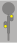
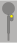
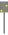
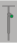
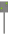

# Vorsignale (Vr) [301.0201]

---

# 1. Allgemeines

## (1)

Vorsignale zeigen an, welches Signalbild am zugehörigen Hauptsignal zu
erwarten ist.

Das Signal Vr 0 kann auch ein Schutzsignal (Sh 0 und Sh 2) ankündigen.

## (2)

Das Signal Vr 0 kann auch das Signal Hp 0 am Sperrsignal (Lichtsignal) ankündigen.

## (3)

Die Wahrnehmung der Stellung des Vorsignals entbindet den Triebfahrzeugführer
nicht von der Beobachtung des Hauptsignals.

## (4)

Die Vorsignale sind entweder ortsfeste Form- oder Lichtsignale oder Wärtersignale.

## (5) Abstand zum zugehörigen Signal

Die Vorsignale stehen in der Regel im Abstand des Bremsweges der Strecke
vor dem zugehörigen Signal.

Stehen sie in einem kürzeren Abstand, so wird dies besonders angezeigt.

## (6)

Der Infrastrukturunternehmer legt den Bremsweg für jede Strecke fest und
gibt ihn bekannt.

### örtliche Zusätze

Der Bremsweg jeder Strecke ist bei den Eisenbahnen des Bundes in örtlichen
Zusätzen angegeben.

## (7) Vorsignalwiederholer

Wo die Sicht auf das Hauptsignal behindert ist, kann das Vorsignal als Lichtsignal
wiederholt sein (Vorsignalwiederholer).

Wegen seiner Kennzeichnung siehe Absätze 16 und 17.

## (8) Vorsignaltafeln

Vorsignale zu ortsfesten Signalen werden nach Richtlinie 301.1401 Abschnitt
2 durch Vorsignaltafeln gekennzeichnet.

## (9) Formvorsignale

Die ortsfesten Formvorsignale zeigen in der Regel eine um eine waagerechte
Achse klappbare gelbe runde Scheibe mit schwarzem Ring und weißem
Rand, unter der sich zur Ankündigung des Signals Hp 2 ein beweglicher gelber,
schwarzgerahmter pfeilförmiger Flügel mit weißem Rand befinden kann.

Im Geltungsbereich der DV 301 kann sich an Stelle des gelben, schwarz gerahmten
Flügels bis auf weiteres ein weißer pfeilförmiger Flügel mit rotem
Rand befinden.

## (10) Nachtzeichen

Als Nachtzeichen sind zwei nach rechts steigende Lichter sichtbar.

Am Nachtzeichen der Vorsignale, die nicht an Hauptsignalen stehen, kann im
Geltungsbereich der DV 301 bis auf weiteres nur ein Licht gezeigt werden.

## (11) Formvorsignale über dem Gleis

Bei den über dem Gleis angebrachten Formvorsignalen befindet sich der Flügel
über der Scheibe.

## (12) Nachtzeichen der Formvorsignale

Die Nachtzeichen der Formvorsignale müssen so lange leuchten wie die der
zugehörigen Haupt- oder Schutzsignale.

## (13) Lichtvorsignale

Die Lichtvorsignale zeigen zwei nach rechts steigende Lichter.

## (14) Vorsignale im verkürzten Abstand

Lichtvorsignale, die in einem um mehr als 5 % kürzeren Abstand als dem
Bremsweg der Strecke vor dem zugehörigen Signal stehen, sind durch ein
weißes Zusatzlicht über dem linken Signallicht etwa in Höhe des rechten Signallichtes
kenntlich.

## (15)

Vorsignale im Geltungsbereich der DV 301, die in einem um mehr als 5 %
kürzeren Abstand aufgestellt sind und nicht mit Zusatzlicht kenntlich gemacht
sind, sind gemäß Richtlinie 301.1401 Abschnitt 2 Absätze 9, 10 und 11 gekennzeichnet.

## (16) Vorsignalwiederholer

Vorsignalwiederholer zeigen das gleiche Signalbild wie Lichtvorsignale mit
einem weißen Zusatzlicht. Sie sind nicht mit Vorsignaltafel ausgerüstet und
nicht durch Vorsignalbaken angekündigt.

## (17)

Vorsignalwiederholer im Geltungsbereich der DV 301, die nicht durch das
Zusatzlicht kenntlich sind, sind am Mast durch eine rechteckige weiße Tafel
mit schwarzem Rand und schwarzem Ring gekennzeichnet.

## (18) Lichtvorsignale am Standort von Hauptsignalen

Lichtvorsignale am Standort von Lichthauptsignalen sind dunkel, wenn sie für
die eingestellte Fahrstraße nicht gelten oder das Hauptsignal Hp 0 zeigt.

## (19) Wärtervorsignale

Die Wärtervorsignale zeigen die senkrechte runde Scheibe wie bei ortsfesten
Formvorsignalen, jedoch unbeweglich und ohne Flügel, bei Nacht zwei gelbe
nach rechts steigende Lichter.

## (20) Links stehendes Wärtervorsignal

Wo an nebeneinander verlaufenden Strecken ein links stehendes Wärtervorsignal
die Fahrt auf dem Nachbargleis beirren würde, ist auf das Signal zu
verzichten und der Zug von der Aufstellung eines Haltsignals zu verständigen.

---

# 2. Signal Vr 0

## (1) Bedeutung

**Halt erwarten.**

## (2) Beschreibung Formsignal

Tageszeichen: Die runde Scheibe steht senkrecht.

Wo ein Flügel vorhanden ist, zeigt er senkrecht nach unten.

Nachtzeichen: Zwei gelbe Lichter nach rechts steigend.

An Vorsignalen im Geltungsbereich der DV 301, die nicht an Hauptsignalen
stehen, kann bis auf weiteres nur ein gelbes Licht gezeigt werden.

## (3) Beschreibung Lichtsignal

Zwei gelbe Lichter nach rechts steigend.

An Vorsignalen im Geltungsbereich der DV 301, die nicht an Hauptsignalen
stehen, kann bis auf weiteres nur ein gelbes Licht gezeigt werden.

---

# 3. Signal Vr 1

## (1) Bedeutung

**Fahrt erwarten.**

## (2) Beschreibung Formsignal

Tageszeichen: Die runde Scheibe liegt waagerecht.

Wo ein Flügel vorhanden ist, zeigt er senkrecht nach unten.

Nachtzeichen: Zwei grüne Lichter nach rechts steigend.

An Vorsignalen im Geltungsbereich der DV 301, die nicht an Hauptsignalen
stehen, kann bis auf weiteres ein grünes Licht gezeigt werden.

## (3) Beschreibung Lichtsignal

Zwei grüne Lichter nach rechts steigend.

An Vorsignalen im Geltungsbereich der DV 301, die nicht an Hauptsignalen
stehen, kann bis auf weiteres ein grünes Licht gezeigt werden.

---

# 4. Signal Vr 2

## (1) Bedeutung

**Langsamfahrt erwarten.**

## (2) Beschreibung Formsignal

Tageszeichen: Die runde Scheibe steht senkrecht, der Flügel zeigt schräg nach rechts abwärts.

Nachtzeichen: Ein gelbes Licht und nach rechts steigend ein grünes Licht.

Das Signal kann im Geltungsbereich der DV 301 auch ein grünes Licht und
nach rechts steigend ein gelbes Licht zeigen.

## (3) Beschreibung Lichtsignal

Ein gelbes Licht und nach rechts steigend ein grünes Licht.

Das Signal kann im Geltungsbereich der DV 301 auch ein grünes Licht und
nach rechts steigend ein gelbes Licht zeigen.

---

# 5. Signal Vr 1/2 (DV 301)

## (1) Bedeutung

**Fahrt oder Langsamfahrt erwarten.**

## (2) Beschreibung

Tageszeichen: Die runde Scheibe liegt waagerecht.

Nachtzeichen: Zwei grüne Lichter nach rechts steigend.

Signale, die nicht an Hauptsignalen stehen, zeigen ein grünes Licht.

## (3) Zweibegriffige Formsignale

Das Signal Vr 1/2 wird nur an zweibegriffigen Formvorsignalen gezeigt.