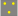

# Zusatzsignale (Zs) (301.0301)

---

# 1. Allgemeines

Zusatzsignale gelten für Zugfahrten.

Das Signal Zs 103 (DV 301) gilt nur für Rangierfahrten.

Ortsfeste Zusatzsignale werden in der Regel an Haupt- oder Vorsignalen gezeigt.

Die Signale Zs 2, Zs 2v, Zs 3, Zs 3v, Zs 6, und Zs 10 (DS 301) können alleinstehend
gezeigt werden.

---

# 2. Signal Zs 1 – Ersatzsignal

## (1) Bedeutung

**Am Signal Hp 0 oder am gestörten Lichthauptsignal ohne schriftlichen Befehl vorbeifahren.**

## (2) Beschreibung

Drei weiße Lichter in Form eines A

oder ein weißes Blinklicht.

## (3) Erlöschen vor Vorbeifahrt

Das Ersatzsignal gilt auch, wenn es erlischt, bevor die Spitze des Zuges am
Signal vorbeigefahren ist.

---

# 3. Signal Zs 2 – Richtungsanzeiger

## (1) Bedeutung

**Die Fahrstraße führt in die angezeigte Richtung.**

## (2) Beschreibung

Ein weißleuchtender Buchstabe.

## (3) Zweck

Der Richtungsanzeiger gibt durch einen Kennbuchstaben an, für welche
Fahrtrichtung oder für welches Streckengleis mehrerer nebeneinander verlaufender
Strecken das Hauptsignal auf Fahrt steht.

Er wird auch angewandt, wenn dem Triebfahrzeugführer bei größeren Bahnhöfen
die Einfahrt in einen bestimmten Bahnhofsteil (z. B. Rangier- oder Personenbahnhof)
angezeigt werden soll.

Der Infrastrukturunternehmer gibt die verwendeten Kennbuchstaben bekannt.

## (4) örtliche Zusätze

Die verwendeten Buchstaben sind im Fahrplan enthalten. Außerdem können
die verwendeten Buchstaben in örtlichen Zusätzen enthalten sein.

---

# 4. Signal Zs 2v – Richtungsvoranzeiger

## (1) Bedeutung

**Richtungsanzeiger (Zs 2) erwarten.**

## (2) Beschreibung

Ein gelbleuchtender Buchstabe.

## (3)

Im Geltungsbereich der DV 301 darf der Richtungsvoranzeiger bis auf weiteres
auch weißleuchtend sein.

---

# 5. Signal Zs 3 – Geschwindigkeitsanzeiger

## (1) Bedeutung

**Die durch die Kennziffer angezeigte Geschwindigkeit darf vom Signal ab
im anschließenden Weichenbereich nicht überschritten werden.**

## (2) Beschreibung

Formsignal: Eine weiße Kennziffer auf dreieckiger schwarzer Tafel mit weißem Rand.

Die Tafel steht in der Regel auf der Spitze; bei beschränktem Raum kann die
Spitze nach oben zeigen.

Lichtsignal: Eine weiß leuchtende Kennziffer.

## (3)

Die gezeigte Kennziffer bedeutet, dass der 10fache Wert in km/h als Fahrgeschwindigkeit
zugelassen ist.

## (4) Signal Zs3 an Blocksignalen

Das Signal wird auch an Blocksignalen selbsttätiger Blockstellen (Sbk) angewendet,
wenn das nächste Signal im verkürzten Bremswegabstand folgt. In
diesem Falle gilt die angezeigte Geschwindigkeit bei Vorbeifahrt der Spitze
des Zuges am Signal.

## (5) Stumpfgleise oder kein ausreichender Durchrutschweg

Die Kennziffer 3 kann anzeigen, dass in Stumpfgleise eingefahren wird oder
dass ein ausreichender Durchrutschweg fehlt.

Die Kennziffern 1 und 2 können anzeigen, dass besonders früh zu halten oder
in ein besetztes Gleis einzufahren ist.

## (6) Alleinstehendes Signal Zs3

Wird innerhalb des anschließenden Weichenbereichs durch ein Signal Zs 3
eine andere Geschwindigkeit angezeigt, gilt diese bis zum Ende des Weichenbereichs.
Eine durch Hauptsignal oder Signal Zs 3 vorgeschriebene Geschwindigkeitsbeschränkung
kann durch ein alleinstehendes Signal Zs 3 bereits
vor dem Ende des anschließenden Weichenbereichs geändert werden.

## (7) Beleuchtung

Das Formsignal ist rückstrahlend oder bei Dunkelheit beleuchtet, es kann bis
auf weiteres nicht rückstrahlend oder beleuchtet sein.

### Formsignal an Lichthauptsignalen

Das Formsignal an Lichthauptsignalen zeigt mit der Spitze nach oben.

---

# 6. Signal Zs 3v – Geschwindigkeitsvoranzeiger

## (1) Bedeutung

**Geschwindigkeitsanzeiger (Zs 3) erwarten**

## (2) Beschreibung

Lichtsignal: Eine gelbleuchtende Kennziffer.

Formsignal: Eine gelbe Kennziffer auf dreieckiger schwarzer Tafel mit gelbem Rand.

## (3)

Das Formsignal ist rückstrahlend.

## (4)

Die gezeigte Kennziffer bedeutet, dass der 10fache Wert in km/h als Fahrgeschwindigkeit
zugelassen ist.

---

# 7. Signal Zs 6 – Gegengleisanzeiger

## (1) Bedeutung

**Der Fahrweg führt in das Streckengleis entgegen der gewöhnlichen Fahrtrichtung.**

## (2) Beschreibung

Lichtsignal: Ein weiß leuchtender schräger Lichtstreifen, dessen Enden in der Regel senkrecht
nach oben und unten abgebogen sind.

DV 301: Die Enden können bis auf weiteres nicht abgewinkelt sein.

Formsignal: Eine rechteckige schwarze Scheibe mit weißem Rand und einem weißen von
rechts nach links steigenden Streifen, dessen Enden senkrecht abgewinkelt
sind. Das Formsignal ist rückstrahlend.

## (3) Geltung

Der Gegengleisanzeiger zeigt an, dass auf zweigleisiger Strecke das Gleis
entgegen der gewöhnlichen Fahrtrichtung befahren werden darf. Der Auftrag,
das Gleis entgegen der gewöhnlichen Fahrtrichtung zu befahren, gilt bis zum
nächsten Bahnhof. Liegt davor eine Abzweig- oder Überleitstelle, gilt der Auftrag
bis dahin.

## (4) Vorübergehende Anwendung

Wird das Formsignal vorübergehend angewendet, wird dies bei den Eisenbahnen
des Bundes durch das Infrastrukturunternehmen in der La bekannt
gegeben. Bei NE-Bahnen wird in einer betrieblichen Anweisung des Betriebsleiters
darauf hingewiesen.

---

# 8. Signal Zs 7 – Vorsichtsignal

## (1) Bedeutung

**Am Signal Hp 0 oder am gestörten Lichthauptsignal ohne schriftlichen
Befehl vorbeifahren! Weiterfahrt auf Sicht.**

## (2) Beschreibung

Drei gelbe Lichter in Form eines V.

## (3) Geltung

Der Auftrag, auf Sicht weiterzufahren, gilt bis zum nächsten Hauptsignal.

## (4)

Das Signal gilt weiter, auch wenn es erlischt, bevor die Spitze des Zuges daran
vorbeigefahren ist.

## (5) örtliche Zusätze

Für das Verhalten nach der Vorbeifahrt sind bei den Gleichstrom-S-Bahnen
Berlin und Hamburg die örtlichen Zusätze zu beachten.

---

# 9. Signal Zs 8 – Gegengleisfahrt-Ersatzsignal

## (1) Bedeutung

**Am Halt zeigenden oder gestörten Hauptsignal vorbeifahren, der Fahrweg
führt in das Streckengleis entgegen der gewöhnlichen Fahrtrichtung.**

## (2) Beschreibung

Drei blinkende weiße Lichter in Form eines A

oder ein weißblinkender Lichtstreifen von rechts nach links steigend.

Die Enden des weißblinkenden Lichtstreifens können nach oben und unten
senkrecht abgebogen sein.

## (3) Geltung

Der Auftrag, das Gleis entgegen der gewöhnlichen Fahrtrichtung zu befahren,
gilt bis zum nächsten Bahnhof. Liegt davor eine Abzweig- oder Überleitstelle,
gilt der Auftrag nur bis dahin.

## (4)

Das Gegengleisfahrt-Ersatzsignal gilt auch, wenn es erlischt, bevor die Spitze
des Zuges am Signal vorbeigefahren ist.

---

# 10. Signal Zs 9 – Bahnübergangstafel (Bü-Tafel) (DV 301)

## (1) Bedeutung

**Nach dem zulässigen Vorbeifahren an dem Halt zeigenden oder gestörten
Lichthauptsignal Halt vor dem Bahnübergang! Weiterfahrt nach Sicherung.**

## (2) Beschreibung

Eine dreieckige, weiße Tafel mit rotem Rand und schwarzem Gatter.

## (3) Aufstellung

Die Bahnübergangstafel steht vor einem mit weiß-gelb-weiß-gelb-weißem,
rotem oder weiß-schwarz-weiß-schwarz-weißem Mastschild gekennzeichneten
Lichthauptsignal, das nur dann einen Fahrtbegriff zeigen kann, wenn der
Bahnübergang technisch gesichert ist.

## (4) mehrere BÜ

Gilt die Bahnübergangstafel für mehrere Bahnübergänge, so ist die entsprechende
Anzahl als schwarze Zahl im Signal Zs 9 dargestellt.

Die genannten Verhaltensregeln gelten dann für jeden dieser Bahnübergänge.

---

# 11. Signal Zs 10 – Endesignal (DS 301)

## (1) Bedeutung

**Ende der Geschwindigkeitsbeschränkung.**

## (2) Beschreibung

Formsignal: Ein weißer Pfeil mit der Spitze nach oben auf pfeilförmiger, schwarzer Tafel.

Lichtsignal: Ein weißleuchtender Pfeil mit der Spitze nach oben.

## (3) Geltung

Das Signal Zs 10 gilt nur für Zugfahrten, die durch Fahrtstellung eines Hauptsignals
zugelassen worden sind, und zeigt an, dass eine mit Signal Hp 2 oder
mit Signal Zs 3 vorgeschriebene Geschwindigkeitsbeschränkung bereits vor
dem Ende des anschließenden Weichenbereichs aufgehoben ist.

## (4)

Das Formsignal ist rückstrahlend.

## (5) mehrere Signale

Innerhalb eines anschließenden Weichenbereichs können mehrere Signale
Zs 10 für verschiedene Fahrwege aufgestellt sein.

---

# 12. Signal Zs 12 – M-Tafel

## (1) Bedeutung

**Am Halt zeigenden oder gestörten Hauptsignal auf mündlichen oder
fernmündlichen Auftrag vorbeifahren.**

## (2) Beschreibung

Eine weiße Tafel mit rotem Rand und rotem „M“ in Schreibschrift.

## (3)

Züge dürfen nach dem Halten am Halt zeigenden oder gestörten Hauptsignal
auf mündlichen oder fernmündlichen Auftrag des Fahrdienstleiters vorbeifahren.

## (4)

Der Fahrdienstleiter darf zur Übermittlung seines Auftrags eine örtliche Aufsicht
beauftragen.

---

# 13. Signal Zs 13 – Stumpfgleis- und Frühhaltanzeiger

## (1) Bedeutung

Fahrt in ein Stumpfgleis oder in ein Gleis mit verkürztem Einfahrweg.

## (2) Beschreibung

Formsignal: Ein um 90° nach links umgelegtes gelbes rückstrahlendes „T“ auf einer rechteckigen
schwarzen Tafel.

Lichtsignal: Ein um 90° nach links umgelegtes gelbleuchtendes „T“.

## (3) Anwendung

Der Stumpfgleis- und Frühhaltanzeiger erscheint am Hauptsignal für die Einfahrt
eines Zuges in

- ein Stumpfgleis (Stumpfgleise der Kopfbahnhöfe ausgenommen),
- ein durch Signale abschnittsweise unterteiltes Gleis, wenn der Einfahrweg verkürzt ist, oder
- ein anderes Gleis, wenn der Einfahrweg um mehr als 30 % kürzer als bei den übrigen Einfahrten ist.

## (4)

Das Signal wird nicht angewendet, wenn das Signal Zs 3 gemäß Abschnitt 5
Absatz 5 gezeigt wird.

---

# 14. Signal Zs 103 – Rautentafel (DV 301)

## (1) Bedeutung

**Das Halt zeigende Hauptsignal gilt nicht für Rangierabteilungen.**

## (2) Beschreibung

Eine rechteckige schwarze Tafel mit weißen Rauten.

## (3)

Die Rautentafel ist am Hauptsignal angebracht.

---

# Zusatzsignale (Zs) – Gleichstrom-S-Bahn Hamburg (301.0301Z41)

---

# 1. Geltungsbereich

Dieser Zusatz gilt nur für Regelzüge im Bereich der Hamburger Gleichstrom-
S-Bahn.

---

# 2. Signal Zs 12 – M-Tafel

Für Regelzüge gilt das Signal Zs 12 – M-Tafel - auch für das unmittelbar am
Hauptsignal stehende Sperrsignal.