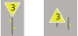

# Langsamfahrsignale (Lf) [301.0501]

---

# 1. Allgemeines

## (1) Zweck

Die Langsamfahrsignale dienen zur Kennzeichnung von Langsamfahrstellen.

Vorübergehende Langsamfahrstellen sind bei Eisenbahnen des Bundes in der
Regel durch Anfang- und Endscheibe (Signale Lf 2 und Lf 3) gekennzeichnet.

## (2) Langsamfahrstellen für einzelne Züge

Langsamfahrsignale werden nicht aufgestellt, wenn die reduzierte Geschwindigkeit
nur für einzelne Zuggattungen bzw. Züge gilt. Die Geschwindigkeitsreduzierung
wird in diesem Fall den betroffenen Zügen durch das Infrastrukturunternehmen
schriftlich bekanntgegeben.

## (3) Züge mit besonderem Geschwindigkeitsprofil

Für Züge mit technischer Überwachung eines bekanntgegebenen besonderen
Geschwindigkeitsprofils gelten die Signale Lf 6 und Lf 7 nicht.

## (4) Geltung

Die Langsamfahrsignale Lf 1, Lf 1/2 (DV 301), Lf 2 und Lf 3 gelten für Züge
und Rangierfahrten. Sie sind nicht ortsfest und dürfen bei den Eisenbahnen
des Bundes nur auf besonderen Auftrag des Eisenbahninfrastrukturunternehmers
aufgestellt werden.

Bei den NE kann der Betriebsleiter auch andere Stellen hierfür bestimmen.

## (5) Kurzfristige Langsamfahrstellen

Die nur für eine Zugfahrt geltenden oder die wegen aufgehobener Signalabhängigkeit
erforderlichen Geschwindigkeitsbeschränkungen werden nicht signalisiert,
wenn die Züge durch Befehl – nicht aber durch die La – unterrichtet
werden.

---

# 2. Signal Lf 1 – Langsamfahrscheibe

## (1) Bedeutung

**Es folgt eine vorübergehende Langsamfahrstelle, auf der die angezeigte
Geschwindigkeit nicht überschritten werden darf.**

## (2) Beschreibung

Tageszeichen: Eine auf der Spitze stehende dreieckige gelbe Scheibe mit weißem Rand
zeigt eine schwarze Kennziffer.

Bei beschränktem Raum kann die Dreieckspitze nach oben zeigen.

Nachtzeichen: Unter dem beleuchteten Tageszeichen zwei schräg nach links steigende gelbe
Lichter.

Bei beschränktem Raum befinden sich die Lichter vor dem Tageszeichen.

## (3) Kennzahl

Die gezeigte Kennziffer bedeutet, dass der 10fache Wert in km/h als Fahrgeschwindigkeit
zugelassen ist.

## (4) NE

Auf NE, die mit höchstens 50 km/h befahren werden, kann auch das Tageszeichen
verwendet werden. Die oberste Landesverkehrsbehörde kann die
Anwendung des Tageszeichens auch bei Geschwindigkeiten über 50 km/h
genehmigen.

## (5)

Die gelbe Scheibe darf rückstrahlend sein; sie ist dann bei Anwendung des
Nachtzeichens nicht beleuchtet.

Die Lampen für die gelben von rechts nach links steigenden Lichter sind bei
den Eisenbahnen des Bundes auch am Tage am Signal angebracht, sie werden
jedoch nur bei Anwendung des Nachtzeichens beleuchtet.

Die Lichter des Nachtzeichens sind bei beschränktem Raum bis zu 15 m vor
dem Signal aufgestellt.

## (6) Angezeigte Geschwindigkeit

Das Signal Lf 1 kündigt an, dass auf dem in der Regel durch die Signale Lf 2
und Lf 3 gekennzeichneten Gleisabschnitt höchstens die durch die Kennziffer
angezeigte Geschwindigkeit angewandt werden darf, bis das letzte Fahrzeug
des Zuges oder der Rangierfahrt den Abschnitt verlassen hat.

## (7) Kennzahlen

Als Kennziffer werden die Ziffern bzw. Zahlen 0,5; 1, 2, 3, 4, 5, 6, 7, 8, 9, 10,
11, 12, 13, 14 und 15 verwendet.

## (8) Aufstellung

Das Signal Lf 1 steht in der Regel im Abstand des Bremsweges der Strecke
vor dem Signal Lf 2.

## (9) Richtungspfeil

Beginnt eine Langsamfahrstelle nach einer Strecken- oder Fahrwegverzweigung,
ist das Signal Lf 1 durch einen gelben Richtungspfeil mit schwarzem
Rand ergänzt, um anzuzeigen, für welche Richtung die Geschwindigkeitsbeschränkung
gilt.

Züge werden durch Befehl oder die La verständigt, für welche Richtung das
Signal gilt.

Bei einem rückstrahlenden Signal Lf 1 muss auch der Richtungspfeil rückstrahlend
sein.

## (10) Aufeinander folgende Langsamfahrstellen

Schließt sich unmittelbar an eine Langsamfahrstelle eine weitere an, die mit
*niedrigerer* Geschwindigkeit zu befahren ist, so ist das Signal Lf 1 für diese
zweite Langsamfahrstelle hinter dem Signal Lf 2 der ersten Langsamfahrstelle
aufgestellt.

Wenn nötig, muss die erste Langsamfahrstelle bis zur Länge des Bremsweges
der Strecke gegen die Fahrtrichtung verlängert werden.

Wird die zweite Langsamfahrstelle mit höherer Geschwindigkeit befahren, so
ist das Signal Lf 1 hierfür erst unmittelbar vor dem zugehörigen Signal Lf 2
aufgestellt.

## (11) Kürzerer Abstand als Bremsweg

Bei den Eisenbahnen des Bundes darf der Eisenbahninfrastrukturunternehmer
– bei den NE der Betriebsleiter – in zwingenden Fällen zulassen, dass
das Signal Lf 1 auch in einem kürzeren Abstand als dem Bremsweg der Strecke
aufgestellt wird, wenn der verkürzte Abstand dem tatsächlich erforderlichen
Bremsweg entspricht.

Der verkürzte Abstand ist dann mit Befehl, in der La oder in einer betrieblichen
Anweisung bekannt gegeben.

## (12) Zweites Signal Lf 1

Wenn Züge hinter dem Signal Lf 1 beginnen oder ihre Fahrt fortsetzen oder
aus der Führung von ETCS entlassen werden, ist ein zweites Signal Lf 1 ohne
die gelben Lichter aufgestellt.

Der Standort des zweiten Signals Lf 1 ist dann mit Befehl, in der La oder in
einer betrieblichen Anweisung bekannt gegeben.

---

# 3. Signal Lf 1/2 – Langsamfahrbeginnscheibe (DV 301)

## (1) Bedeutung

**Auf dem am Signal beginnenden, in der Regel durch eine Endscheibe
begrenzten Gleisabschnitt darf die angezeigte Geschwindigkeit nicht
überschritten werden.**

## (2) Beschreibung

Eine rechteckige, gelbe Scheibe mit weißem Rand zeigt eine schwarze Kennziffer.

## (3) Angezeigte Geschwindigkeit

Die durch die Kennziffer angezeigte Geschwindigkeitsbeschränkung gilt, bis
das letzte Fahrzeug den Gleisabschnitt verlassen hat.

## (4) Kennzahlen

Für die Anwendung der Kennziffern gilt Abschnitt 2 Absatz 7 sinngemäß.

## (5) Beleuchtung

Das Signal Lf 1/2 ist bei Dunkelheit zu beleuchten.

Der Eisenbahninfrastrukturunternehmer darf Ausnahmen zulassen.

## (6) Aufstellung an Hauptgleisen

Das Signal zeigt Geschwindigkeitsbeschränkungen auf den Bahnhofshauptgleisen
an, soweit diese keine durchgehenden Hauptgleise sind.

Es steht am Anfang des langsam zu befahrenden Gleises unmittelbar rechts
neben dem Gleis und wird nicht signalmäßig vorangekündigt.

Reicht die Entfernung vom Gleisanfang bis zum Beginn des langsam zu befahrenden
Gleisabschnitts für die Abbremsung aus (siehe Abschnitt 2 Absatz
11), so sind anstelle des Signals Lf 1/2 die Signale Lf 1 und Lf 2 aufzustellen.

## (7) La

Der Triebfahrzeugführer wird über die aufgestellten Signale Lf 1/2 durch die
La unterrichtet.

Er hat sich bei der Einfahrt auf die in der La angegebene Geschwindigkeit –
bei unterschiedlichen Geschwindigkeitsangaben für einzelne Gleise auf die
niedrigste – einzurichten.

Ab Signal Lf 1/2 darf die dort angezeigte Geschwindigkeit nicht überschritten
werden.

Bei Ausfahrten wird der Triebfahrzeugführer durch das Signal Lf 3 darauf hingewiesen,
dass für das betreffende Gleis eine Geschwindigkeitsbeschränkung
besteht.

## (8) Ungültiges Signal Lf 1/2

Solange ein Signal Lf 1/2 als ungültig gekennzeichnet ist, darf das Signal Lf 3
nicht aufgestellt sein.

---

# 4. Signal Lf 2 – Anfangscheibe

## (1) Bedeutung

**Anfang der vorübergehenden Langsamfahrstelle.**

## (2) Beschreibung

Eine rechteckige, auf der Schmalseite stehende oder quadratische gelbe
Scheibe mit weißem Rand und schwarzem A.

## (3) Aufstellung

Das Signal Lf 2 steht am Anfang des langsam zu befahrenden Gleisabschnitts.

## (4) Beleuchtung

Das Signal Lf 2 ist bei Dunkelheit beleuchtet oder es ist rückstrahlend.

## (5) NE

Bei den NE bestimmt der Betriebsleiter, ob das Signal Lf 2 aufzustellen ist.

Er bestimmt auch, ob es zu beleuchten ist.

## (6) Richtungspfeil

Am Signal Lf 2 ist der gemäß Abschnitt 2 Absatz 9 angebrachte Richtungspfeil
wiederholt, wenn auch das Signal Lf 2 vor der Strecken- oder Fahrwegverzweigung
steht.

Bei einem rückstrahlenden Signal Lf 2 ist auch der Richtungspfeil rückstrahlend.

## (7) Besondere Aufstellung der Signale Lf 1 und Lf 2

Innerhalb einer vorübergehenden Langsamfahrstelle ist ein weiteres Signal Lf
1 – ohne die gelben Lichter – und unmittelbar dahinter ein weiteres Signal Lf 2
aufgestellt,

- a) am Halteplatz der Züge, wenn Züge in der vorübergehenden Langsamfahrstelle
planmäßig beginnen oder ihre Fahrt mit Personalwechsel fortsetzen,

- b) hinter der letzten Weiche im Fahrweg, wenn Züge von einmündenden
Hauptgleisen in die vorübergehende Langsamfahrstelle einfahren und die
am Hauptsignal zugelassene Geschwindigkeit geringer ist als in der Langsamfahrstelle.

Der Standort dieser zweiten Signale ist dann mit Befehl, in der La oder in einer
betrieblichen Anweisung bekannt gegeben.

---

# 5. Signal Lf 3 – Endscheibe

## (1) Bedeutung

**Ende der vorübergehenden Langsamfahrstelle.**

## (2) Beschreibung

Eine rechteckige, auf der Schmalseite stehende oder quadratische weiße
Scheibe mit schwarzem E.

## (3) Aufstellung

Das Signal Lf 3 steht am Ende des langsam zu befahrenden Gleisabschnitts.
Auf eingleisigen Strecken kann das Signal Lf 3 unmittelbar links neben dem
Gleis aufgestellt sein.

Bei der DB AG steht das Signal an eingleisigen Strecken unmittelbar rechts.

## (4) Aufeinander folgende Langsamfahrstellen

Das Signal Lf 3 ist nicht aufgestellt, wenn eine zweite Langsamfahrstelle unmittelbar
anschließt.

## (5) Bahnübergänge

Wenn zur Kennzeichnung des Endes einer vorübergehenden Langsamfahrstelle
nach dem Befahren von Bahnübergängen unter dem hierfür aufgestellten
Signal Lf 3 eine Tafel mit der Aufschrift „BÜ“ angebracht ist, darf abweichend
von Abschnitt 2 Absatz 6 die Geschwindigkeit erhöht werden, wenn
das führende Fahrzeug die Mitte des Bahnübergangs erreicht hat.

## (6) Beleuchtung

Das Signal Lf 3 ist bei Dunkelheit beleuchtet oder es ist rückstrahlend.

## (7) NE

Bei den NE bestimmt der Betriebsleiter, ob das Signal Lf 3 aufzustellen ist. Er
bestimmt auch, ob es zu beleuchten ist.

---

# 6. Signal Lf 4 – Geschwindigkeitstafel (DS 301)

## (1) Bedeutung

**Es folgt eine ständige Langsamfahrstelle, auf der die angezeigte Geschwindigkeit
nicht überschritten werden darf.**

## (2) Beschreibung

Eine auf der Spitze stehende dreieckige weiße Tafel mit schwarzem Rand
zeigt eine schwarze Kennziffer.

Bei beschränktem Raum kann die Dreieckspitze nach oben zeigen.

## (3) Kennziffer

Die gezeigte Kennziffer bedeutet, dass der 10fache Wert in km/h als Fahrgeschwindigkeit
zugelassen ist.

Wegen der Kennziffer siehe Abschnitt 2 Absatz 7.

## (4) Aufstellung

Das Signal Lf 4 steht nur auf Nebenbahnen und ist beleuchtet, wenn der Betrieb
es erfordert.

Es ist in der Regel im Abstand des Bremsweges der Strecke vor dem langsam
zu befahrenden Gleisabschnitt aufgestellt; vor Bahnübergängen gemäß
Absatz 5c kann es auch in einem für das Abbremsen ausreichenden Abstand
stehen.

## (5)

Das Signal Lf 4 ist aufgestellt,

- a) wo die zulässige Geschwindigkeit vor der ständigen Langsamfahrstelle um
25 % und mehr größer ist als auf der Langsamfahrstelle.
Das Signal kann entfallen, wenn ein sonstiger geeigneter Anhalt für den
Triebfahrzeugführer vorhanden ist,
- b) wo an einem Vorsignal angezeigt werden soll, dass vom zugehörigen
Hauptsignal ab bei Stellung Hp 1 die angezeigte Geschwindigkeit nicht
überschritten werden darf,
- c) wo die Geschwindigkeit vor Bahnübergängen ermäßigt werden muss.
Die Geschwindigkeitsbeschränkung muss am Signal Lf 5, wo dieses nicht
aufgestellt ist, vor dem Bahnübergang durchgeführt sein.

Sie ist beizubehalten, bis das erste Fahrzeug etwa die Straßenmitte erreicht
hat.

---

# 7. Signal Lf 5 – Anfangtafel (DS 301)

## (1) Bedeutung

**Die auf der Geschwindigkeitstafel (Lf 4) angezeigte Geschwindigkeitsbeschränkung
muss durchgeführt sein.**

## (2) Beschreibung

Eine rechteckige, auf der Schmalseite stehende weiße Tafel mit schwarzem A.

## (3) Aufstellung

Das Signal Lf 5 ist nur auf Nebenbahnen dort aufgestellt, wo es erforderlich
ist, vor Bahnübergängen die Stelle besonders zu kennzeichnen, von der ab
die mit Signal Lf 4 angezeigte Geschwindigkeit gilt.

---

# 8. Signal Lf 6 –Geschwindigkeits-Ankündesignal

## (1) Bedeutung

**Ein Geschwindigkeitssignal (Lf 7) ist zu erwarten.**

## (2) Beschreibung

Eine auf der Spitze stehende, schwarz- und weißumrandete dreieckige gelbe
Tafel zeigt eine schwarze Kennziffer.

Die gezeigte Kennziffer bedeutet, dass der 10fache Wert in km/h als Fahrgeschwindigkeit
vom Signal Lf 7 ab zugelassen ist.

Bei beschränktem Raum kann die Dreieckspitze nach oben zeigen.

## (3) Beleuchtung

Das Signal Lf 6 ist bei Dunkelheit beleuchtet oder es ist rückstrahlend.

## (4) Aufstellung

Das Signal Lf 6 ist aufgestellt, wenn ab dem Signal Lf 7 eine verminderte Geschwindigkeit
zugelassen ist.

Es steht in der Regel im Abstand des Bremsweges der Strecke vor dem Signal
Lf 7; auf Nebenbahnen vor Bahnübergängen steht es in der Regel in einem
für das Abbremsen ausreichenden Abstand vor dem Signal Lf 7. Auf diesen
verkürzten Abstand ist dann im Fahrplan oder in einer schriftlichen Anweisung
hingewiesen.

Außerdem darf bei Eisenbahnen des Bundes der Eisenbahninfrastrukturunternehmer
– bei NE der Betriebsleiter – in zwingenden Fällen zulassen, dass
das Signal Lf 6 auch in einem kürzeren Abstand als dem Bremsweg der Strecke
aufgestellt wird, wenn der verkürzte Abstand mindestens dem tatsächlich
erforderlichen Bremsweg entspricht. Der verkürzte Abstand ist dann im Fahrplan
oder in schriftlichen Anweisungen bekannt gegeben.

## (5) Kennzahlen

Als Kennziffer werden die Ziffern bzw. Zahlen 1, 2, 3, 4, 5, 6, 7, 8, 9, 10, 11,
12, 13, 14 und 15 verwendet.

## (6) Richtungspfeil

Beginnt die mit Signal Lf 6 angekündigte Geschwindigkeitsbeschränkung
nach einer Strecken- oder Fahrwegverzweigung, ist das Signal Lf 6 durch einen
gelben Richtungspfeil mit schwarzem Rand zu ergänzen, um anzuzeigen,
für welche Richtung die Geschwindigkeitsbeschränkung gilt.

Bei einem rückstrahlenden Signal ist auch der Richtungspfeil rückstrahlend.

## (7) Bekanntgabe

Züge werden durch den Fahrplan oder in schriftlichen Anweisungen verständigt,
für welche Richtung das Signal gilt.

### örtliche Zusätze

Die Richtung ist in örtlichen Zusätzen angegeben.

## (8) Nebenbahnen

Auf Nebenbahnen – ausgenommen bei Geschwindigkeitsbeschränkungen vor
Bahnübergängen – kann das Signal Lf 6 mit Genehmigung der Aufsichtsbehörde
entfallen, wenn ein sonstiger durch die Gestaltung der Bahnanlagen
geeigneter Anhalt für den Triebfahrzeugführer vorhanden ist. Dieser geeignete
Anhalt ist dann im Fahrplan bekannt gegeben.

---

# 9. Signal Lf 7 – Geschwindigkeitssignal

## (1) Bedeutung

**Die angezeigte Geschwindigkeit darf vom Signal ab nicht überschritten
werden.**

## (2) Beschreibung

Eine rechteckige, auf der Schmalseite stehende oder quadratische weiße Tafel
mit schwarzem Rand zeigt eine schwarze Kennziffer.

Die gezeigte Kennziffer bedeutet, dass der 10fache Wert in km/h als Fahrgeschwindigkeit
zugelassen ist.

## (3) Geschwindigkeitswechsel

Das Signal Lf 7 kennzeichnet einen Geschwindigkeitswechsel.

## (4) Beleuchtung

Das Signal ist bei Dunkelheit beleuchtet oder es ist rückstrahlend.

## (5) Kennzahlen

Als Kennziffer werden die Ziffern bzw. Zahlen 1, 2, 3, 4, 5, 6, 7, 8, 9, 10, 11,
12, 13, 14, 15 und 16 verwendet.

## (6) Signal Lf 7 am Hauptsignal

Das an einem Hauptsignal aufgestellte Signal Lf 7 gilt nur bei Stellung Hp 1,
Ks 1 ohne Zs 3 oder Ks 2 ohne Zs 3.

## (7) Streckenverzweigung

Ein zu signalisierender Geschwindigkeitswechsel liegt auch vor, wenn an Abzweigstellen
und an Streckenverzweigungen in Bahnhöfen bei Übergang von
einer Strecke auf eine andere eine Geschwindigkeitsänderung zu beachten
ist.

## (8) Nebenbahnen

Auf Nebenbahnen – ausgenommen bei Geschwindigkeitsbeschränkungen vor
Bahnübergängen – kann das Signal Lf 7 mit Genehmigung der Aufsichtsbehörde
entfallen, wenn ein sonstiger geeigneter Anhalt durch die Gestaltung
der Bahnanlagen für den Triebfahrzeugführer vorhanden ist. Dieser geeignete
Anhalt ist dann im Fahrplan bekannt gegeben.

## (9) Bahnübergänge

Wenn zur Kennzeichnung des Endes einer Geschwindigkeitsbeschränkung
nach dem Befahren von Bahnübergängen unter dem hierfür aufgestellten
Signal Lf 7 eine Tafel mit der Aufschrift „BÜ“ angebracht ist, darf die Geschwindigkeit
erhöht werden, wenn das führende Fahrzeug die Mitte des
Bahnübergangs erreicht hat.

---

# 10. Signal Lf 4 – Geschwindigkeitstafel (DV 301)

## (1) Bedeutung

**Die angezeigte Geschwindigkeit darf nicht überschritten werden.**

## (2) Beschreibung

Eine auf der Spitze stehende dreieckige, weiße Tafel mit schwarzem Rand
zeigt eine schwarze Geschwindigkeitszahl.

Bei beschränktem Raum kann die Dreieckspitze nach oben zeigen.

## (3)

Durch das Signal Lf 4 werden angezeigt

- a) die Geschwindigkeitswechsel der im VzG festgelegten und, soweit zutreffend,
im Fahrplan bekannt gegebenen Geschwindigkeiten für die Streckengleise
und die durchgehenden Hauptgleise der Bahnhöfe.

- b) Geschwindigkeitsbeschränkungen für das Befahren von nicht technisch
gesicherten Bahnübergängen.

## (4) Anwendung

Ist die Geschwindigkeit herabzusetzen, wird das Signal Lf 4 entsprechend
dem Bremsweg der betreffenden Strecke vor der durch Signal Lf 5 gekennzeichneten
Stelle des Geschwindigkeitswechsels (siehe Abschnitt 11 Absatz
3) aufgestellt.[^1]

Der Eisenbahninfrastrukturunternehmer darf in zwingenden Fällen zulassen,
dass das Signal Lf 4 in einem kürzeren Abstand als dem Bremsweg der Strecke
aufgestellt wird, wenn der verkürzte Abstand mindestens dem für die Herabsetzung
der Geschwindigkeit tatsächlich erforderlichen Bremsweg entspricht.

Der Mindestabstand beträgt jedoch auf Hauptbahnen 300 m und auf Nebenbahnen
150 m.

Auf den verkürzten Abstand wird im VzG und im Fahrplan hingewiesen.

Bei einer Geschwindigkeitserhöhung steht das Signal Lf 4 an einer Stelle des
Geschwindigkeitswechsels.

Besondere Regelungen für Bahnhöfe, Abzweigstellen und nicht technisch gesicherte
Bahnübergänge sind in den Absätzen 5 und 6 genannt.

## (5)

Ein zu signalisierender Geschwindigkeitswechsel im Streckengleis oder im
durchgehenden Hauptgleis eines Bahnhofs liegt auch vor

- a) an den Abzweigstellen und an Streckenverzweigungen in Bahnhöfen,
wenn beim Übergang von einer Strecke auf eine andere eine Geschwindigkeitsänderung
zu beachten ist.

- b) am Ende einer durch ein Hauptsignal angezeigten Geschwindigkeitsbeschränkung.

Das Signal Lf 4 ist in diesen Fällen hinter der letzten auf der Abzweigstelle
oder bei der Ausfahrt befahrenen Weiche aufzustellen, ausgenommen dann,
wenn eine Geschwindigkeitsbeschränkung anzuzeigen ist.

Das in diesem Falle vor der letzten auf der Abzweigstelle oder bei der Ausfahrt
befahrenen Weiche aufgestellte Signal Lf 4 ist durch einen weißen Richtungspfeil
mit schwarzem Rand zu ergänzen, um anzuzeigen, für welche
Fahrtrichtung die Geschwindigkeitsbeschränkung gilt.

Bei einem rückstrahlenden Signal Lf 4 muss auch der Richtungspfeil rückstrahlend
sein.

## (6) Signal Lf 4 an nicht technisch gesicherten Bahnübergängen

Die Geschwindigkeitstafel ist vor nicht technisch gesicherten Bahnübergängen
aufzustellen, wenn die Geschwindigkeit für das Befahren des Bahnübergangs
herabgesetzt werden muss.

Das Signal Lf 4 wird in diesem Falle stets im Abstand des für die Herabsetzung
der Geschwindigkeit tatsächlich erforderlichen Bremsweges, mindestens
jedoch 150 m vor dem Bahnübergang oder vor dem Signal Lf 5 aufgestellt.

Hinsichtlich der Vereinigung mit Signal Pf 2 wird auf Richtlinie 301.1501 Abschnitt
10 Absatz 4 verwiesen.

Gilt das Signal Pf 2 für mehrere Bahnübergänge, ist auch die durch das Signal
Lf 4 angezeigte Geschwindigkeitsbeschränkung für die am Signal Pf 2 angegebene
Anzahl von Bahnübergängen gültig.

Die Geschwindigkeitsbeschränkung muss erreicht sein, sobald das erste
Fahrzeug das Signal Lf 5, wo dieses nicht aufgestellt ist, den Bahnübergang
erreicht hat.

Sie ist beizubehalten, bis das erste Fahrzeug den Bahnübergang verlassen
hat.

Die Geschwindigkeitserhöhung hinter dem Bahnübergang wird nicht durch
das Signal Lf 4 angezeigt.

Wo in Ausnahmefällen vor dem Befahren eines nicht technisch gesicherten
Bahnübergangs zu halten ist, zeigt das Signal Lf 4 die Zahl 0.

Außerdem ist das Signal Lf 5 aufzustellen.

## (7) Geschwindigkeit an Hauptsignalen

Das Signal Lf 4 wird auch angewandt zur Ankündigung eines Hauptsignals,
durch das auch bei dem Signal Hp 1 eine Geschwindigkeitsbeschränkung innerhalb
des anschließenden Weichenbereichs vorgeschrieben wird.

Das Signal Lf 4 wird dann in Höhe des Vorsignals aufgestellt.

Zwischen dem Vorsignal und dem Ende des Weichenbereichs darf dann kein
weiteres Signal Lf 4 aufgestellt werden.

## (8) Aufstellung

Die Geschwindigkeitstafel ist ortsfest und steht unmittelbar rechts, auf zweigleisiger
Strecke für Fahrten entgegen der gewöhnlichen Fahrtrichtung unmittelbar
links neben dem zugehörigen Gleis.

## (9) Beleuchtung

Das Signal Lf 4 wird bei Dunkelheit nicht beleuchtet, kann aber rückstrahlend
sein.

[^1]: Das Signal Lf 5 kann bis auf weiteres nicht aufgestellt sein.

---

# 11. Signal Lf 5 – Eckentafel (DV 301)

## (1) Bedeutung

**Die durch das Signal Lf 4 angezeigte Geschwindigkeitsbeschränkung
muss durchgeführt sein.**

## (2) Beschreibung

Eine rechteckige, weiße Tafel mit schwarzen Ecken.

## (3)

Die Eckentafel kennzeichnet die Stelle, an der eine durch Signal Lf 4 angezeigte
Geschwindigkeitsbeschränkung erreicht sein muss.[^2]

Vor nicht technisch gesicherten Bahnübergängen auf Nebenbahnen ist die
Eckentafel dann aufgestellt, wenn die Stelle besonders zu kennzeichnen ist,
von der ab die durch Signal Lf 4 angezeigte Geschwindigkeit gilt.

Wenn das Signal Lf 4 die Zahl 0 zeigt, ist stets das Signal Lf 5 aufgestellt; es
kennzeichnet die Stelle, an der zu halten ist.

## (4) Richtungspfeil

Am Signal Lf 5 ist der gemäß Abschnitt 10 Absatz 5 angebrachte Richtungspfeil
zu wiederholen, wenn auch das Signal Lf 5 vor der Strecken- oder Fahrwegverzweigung
steht.

Bei einem rückstrahlenden Signal Lf 5 muss auch der Richtungspfeil rückstrahlend
sein.

## (5) Aufstellung

Die Eckentafel ist ortsfest und steht unmittelbar rechts, auf zweigleisiger Strecke
für Fahrten entgegen der gewöhnlichen Fahrtrichtung unmittelbar links
neben dem zugehörigen Gleis.

## (6) Beleuchtung

Das Signal Lf 5 wird bei Dunkelheit nicht beleuchtet, kann aber rückstrahlend
sein.

[^2]: Das Signal Lf 5 kann – ausgenommen in den genannten Fällen vor nicht technisch gesicherten
Bahnübergängen auf Nebenbahnen – bis auf weiteres nicht aufgestellt sein.
