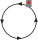

# Schutzsignale (Sh) [301.0601]

---

# 1. Allgemeines

## (1) Zweck

Schutzsignale dienen dazu, ein Gleis abzuriegeln, den Auftrag zum Halten zu
erteilen oder die Aufhebung eines Fahrverbots anzuzeigen.

## (2)

Die Schutzsignale gelten für Zug- und Rangierfahrten.

## (3) Verwendung

Die Signale Sh 0 und Sh 1 werden verwendet am Sperrsignal, Gleissperrensignal
(Formsignal) und Abschlusssignal von Stumpfgleisen.

## (4)

Das Formsignal kann mit einem Wartezeichen (Signal Ra 11) verbunden sein.

## (5) Standort

Abweichend von Richtlinie 301.0002 Abschnitt 2 Absatz 3 dürfen die Signale
bei Gleiswaagen, Schiebebühnen und Drehscheiben links aufgestellt sein.

## (6) Beleuchtung

Signale Sh 0 an Gleisabschlüssen, die Stumpfgleiseinfahrten begrenzen, sind
bei Dunkelheit beleuchtet. Übrige Signale Sh 0 und Formsignale Sh 1 sind
rückstrahlend oder beleuchtet, wenn der Betrieb es erfordert.

---

# 2. Signal Sh 0

## (1) Bedeutung

**Halt! Fahrverbot.**

## (2) Beschreibung

Ein waagerechter schwarzer Streifen in runder weißer Scheibe auf schwarzem
Grund.

## (3)

Bei Gleiswaagen und Drehscheiben zeigt das Signal an, dass sie nicht befahren
werden dürfen.

Das Gleissperrensignal zeigt an, dass die Gleissperre aufgelegt ist.

## (4)

Der Eisenbahninfrastrukturunternehmer bestimmt, wo die Stellung des Signals
auch von hinten erkennbar sein soll. Es zeigt dann bei Tage zwei weiße
runde Scheiben auf schwarzem Grund waagerecht nebeneinander; bei Dunkelheit
sind die Scheiben rückstrahlend oder beleuchtet.

---

# 3. Signal Sh 1, Signal Ra 12 – Rangierfahrtsignal (DV 301)

## (1) Bedeutung

**Signal Sh 1: Fahrverbot aufgehoben.**

**Signal Ra 12 (DV 301): Rangierfahrt erlaubt.**

## (2) Beschreibung

Signal Sh 1 Formsignal: Ein nach rechts steigender schwarzer Streifen auf runder weißer Scheibe.

Signal Sh 1 Lichtsignal (DS 301), Signal Ra 12 (DV 301):

Zwei weiße Lichter nach rechts steigend.

## (3) In Verbindung mit Signal Hp 0

In Verbindung mit Signal Hp 0 zeigt das Signal an, dass das Haltegebot für
Rangierfahrten aufgehoben ist.

## (4) Gleissperrensignal (DS 301)

Durch das Signal Sh 1 am Gleissperrensignal wird keine Zustimmung des
Weichenwärters erteilt.

Das Signal Sh 1 am Gleissperrensignal zeigt an, dass die Gleissperre abgelegt
ist.

## (5) Mehrere Rangierfahrten vor dem Signal

Wenn mehrere Rangierfahrten vor dem Signal halten oder sich ihm nähern,
gilt die Zustimmung nur für die erste Rangierfahrt.

## (6) Lichtsignal erlischt vorzeitig

Erlischt das Signal Sh 1 – Lichtsignal (DS 301) – bzw. das Signal Ra 12
(DV 301), bevor die Spitze der Rangierfahrt daran vorbeigefahren ist, so ist
das erneute Aufleuchten des Signals abzuwarten.

## (7) Formsignal am Wartezeichen

Ist das Formsignal mit einem Wartezeichen verbunden, so ist stets eine besondere
Zustimmung des Weichenwärters zur Vorbeifahrt abzuwarten.

## (8) Formsignal von hinten erkennbar

Der Eisenbahninfrastrukturunternehmer bestimmt, wo die Stellung des Formsignals
auch von hinten erkennbar sein soll. Es zeigt dann bei Tage eine weiße
runde Scheibe auf schwarzem Grund, bei Dunkelheit ist die Scheibe rückstrahlend
oder beleuchtet.

---

# 4. Signal Sh 2

## (1) Bedeutung

**Schutzhalt.**

## (2) Beschreibung

Tageszeichen: Eine rechteckige rote Scheibe mit weißem Rand.

Nachtzeichen: Ein rotes Licht am Tageszeichen oder am Ausleger des Wasserkrans.

## (3) Verwendung

Das Signal wird verwendet als

- Wärterhaltscheibe,
- Abschlusssignal eines Stumpfgleises.

## (4) Aufstellung

Die Wärterhaltscheibe ist nicht ortsfest.

Ist die Regelaufstellung des Signals Sh 2 gemäß Richtlinie 301.0002 Abschnitt
2 Absatz 3 nicht möglich, ist es im Gleis aufgestellt.

## (5) Wärterhaltscheibe

Die Wärterhaltscheibe wird verwendet

- a) zur Kennzeichnung einer Gleisstelle, die vorübergehend nicht befahren werden darf,
- b) zur Kennzeichnung einer Stelle, an der Züge ausnahmsweise anhalten sollen.

## (6)

Auf freier Strecke wird die Wärterhaltscheibe in mindestens 50 m Sicherheitsabstand
vor der zu schützenden Stelle aufgestellt.

## (7) Tunnel

Zur Abriegelung eines Gleises im Tunnel oder in dessen Nähe wird die Wärterhaltscheibe
außerhalb des Tunnels aufgestellt.

Ausnahmen für lange Tunnel ordnet bei den Eisenbahnen des Bundes der Eisenbahninfrastrukturunternehmer
– bei den NE der Betriebsleiter – an.

## (8) Aufheben des Haltauftrags

Der Haltauftrag wird durch Entfernen oder Wegdrehen bzw. Wegklappen des
Signals aufgehoben, soweit der Auftrag zur Vorbeifahrt an der Wärterhaltscheibe
nicht durch Befehl erteilt wird.

## (9) Beleuchtung

Bei ausreichender Außenbeleuchtung oder bei einfachen Verhältnissen wird
am Abschlusssignal des Einfahrstumpfgleises nur das Tageszeichen gezeigt.

Das Abschlusssignal übriger Stumpfgleise ist rückstrahlend oder beleuchtet,
wenn der Betrieb es erfordert.

---

# 5. Signal Sh 3 – Kreissignal

## (1) Bedeutung

**Sofort halten.**

## (2) Beschreibung

Tageszeichen: Eine rot-weiße Signalfahne, irgendein Gegenstand oder der Arm wird im Kreis
geschwungen.

Nachtzeichen: Eine Laterne, möglichst rot abgeblendet, oder ein leuchtender Gegenstand
wird im Kreis geschwungen.

## (3) Anwendung

Das Kreissignal wird gegeben, wenn ein Zug oder eine Rangierfahrt sofort
zum Halten gebracht werden muss.

Wenn es zweifelhaft ist, ob der Zug oder die Rangierfahrt das Signal wahrnehmen
werden, ist auch das Horn- und Pfeifsignal (Sh 5) anzuwenden.

---

# 6. Signal Sh 5 – Horn- und Pfeifsignal

## (1) Bedeutung

**Sofort halten.**

## (2) Beschreibung

Mehrmals nacheinander drei kurze Töne.

## (3)

Das Signal wird gegeben,

- a) wenn das Kreissignal (Sh 3) nicht gegeben werden kann oder nicht ausreichend erscheint,
- b) um andere Mitarbeiter zum Anhalten eines Zuges oder einer Rangierfahrt zu veranlassen.
