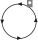

# Signale für den Rangierdienst (Ra) – Allgemeines (301.0700)

---

## (1)

Signale für den Rangierdienst dienen dazu, Rangierfahrten den Auftrag zur
Ausführung einer Rangierbewegung zu erteilen sowie Zügen und Rangierfahrten
bestimmte Hinweise zu geben.

## (2)

Zu den Signalen für den Rangierdienst gehören

- A. die Rangiersignale (Signale Ra 1 bis Ra 5, siehe Richtlinie 301.0701),
- B. die Abdrücksignale (Signal Ra 6 bis Ra 9, siehe Richtlinie 301.0702),
- C. die sonstigen Signale für den Rangierdienst (Signale Ra 10 bis Ra 13, siehe
Richtlinie 301.0703).

---
---

# Signale für den Rangierdienst (Ra) – A. Rangiersignale (301.0701)

# 1. Allgemeines

## (1)

Die Signale sind gleichzeitig hörbar und sichtbar zu geben.
Sie gelten bereits, wenn sie nur sichtbar aufgenommen werden (siehe aber
Signal Ra 5).

## (2) Signalmittel für Rangiersignale

Für das Geben der sichtbaren Zeichen wird bei Dunkelheit eine weißleuchtende
Laterne verwendet.

## (3) Geschwindigkeit ermäßigen

Wird beim Rangieren der Arm – bei Dunkelheit mit der Laterne – hochgehalten
und gleichzeitig mit der Mundpfeife oder dem Horn ein langer Ton gegeben,
so bedeutet dies Mäßigung der Geschwindigkeit.

---

# 2. Signal Ra 1

## (1) Bedeutung

**Wegfahren.**

## (2) Beschreibung

Mit der Mundpfeife oder dem Horn: Ein langer Ton

und mit dem Arm:

Tageszeichen: Senkrechte Bewegung des Arms von oben nach unten.

Nachtzeichen: Senkrechte Bewegung der Laterne von oben nach unten.

## (3)

Das Signal bedeutet, die Rangierfahrt soll in Richtung vom Signalgeber wegfahren.

## (4)

Wenn nach dem Standort des Signalgebers Zweifel über die beabsichtigte
Bewegungsrichtung entstehen können, ist der Auftrag mündlich zu geben
oder die Richtung anzuzeigen.

---

# 3. Signal Ra 2

## (1) Bedeutung

**Herkommen.**

## (2) Beschreibung

Mit der Mundpfeife oder mit dem Horn: Zwei mäßig lange Töne

und mit dem Arm:

Tageszeichen: Langsame waagerechte Bewegung des Arms hin und her.

Nachtzeichen: Langsame waagerechte Bewegung der Laterne hin und her.

## (3)

Das Signal bedeutet, die Rangierfahrt soll in Richtung auf den Signalgeber zu
fahren.

## (4)

Wenn nach dem Standort des Signalgebers Zweifel über die beabsichtigte
Bewegungsrichtung entstehen können, ist der Auftrag mündlich zu geben
oder die Richtung anzuzeigen.

---

# 4. Signal Ra 3

## (1) Bedeutung

**Aufdrücken.**

## (2) Beschreibung

Mit der Mundpfeife oder mit dem Horn: Zwei kurze Töne schnell nacheinander.

und mit den Armen:

Tageszeichen: Beide Arme in Schulterhöhe nach vorn heben und die flach
ausgestreckten Hände wiederholt einander nähern.

Nachtzeichen: Wie am Tage, in der einen Hand eine Laterne.

## (3)

Das Signal bedeutet, das Triebfahrzeug soll Fahrzeuge zum An- oder Abkuppeln
usw. aufdrücken.

## (4)

Nach dem Aufdrücken ist auch ohne Haltauftrag anzuhalten.

---

# 5. Signal Ra 4

## (1) Bedeutung

**Abstoßen.**

## (2) Beschreibung

Mit der Mundpfeife oder mit dem Horn: Zwei lange Töne und ein kurzer Ton.

und mit dem Arm:

Tageszeichen: Zweimal eine waagerechte Bewegung des Arms vom Körper nach außen und
eine schnelle senkrechte Bewegung nach unten.

Nachtzeichen: Zweimal eine waagerechte Bewegung der Laterne vom Körper nach außen
und eine schnelle senkrechte Bewegung nach unten.

## (3)

Das Signal bedeutet, das Triebfahrzeug soll Fahrzeuge abstoßen.

---

# 6. Signal Ra 5

## (1) Bedeutung

**Rangierhalt.**

## (2) Beschreibung

Mit der Mundpfeife oder mit dem Horn: Drei kurze Töne schnell nacheinander

und mit dem Arm:

Tageszeichen: Kreisförmige Bewegung des Arms.

Nachtzeichen: Kreisförmige Bewegung der Handlaterne.

## (3)

Das Signal gilt bereits, wenn es nur hörbar oder nur sichtbar aufgenommen
wird.

---
---

# Signale für den Rangierdienst (Ra) – B. Abdrücksignale (301.0702)

# 1. Allgemeines

## (1) Zweck

Die Abdrücksignale dienen der Verständigung beim Rangieren am Ablaufberg;
sie können Form- oder Lichtsignale sein.

## (2) Form

Die Formsignale bestehen aus einem um den Mittelpunkt einer runden Scheibe
drehbaren Balken, der bei Dunkelheit beleuchtet wird.

Die runden Scheiben der Formsignale sind weiß oder schwarz.

## (3)

Bei den Lichtsignalen wird das Signalbild durch weiße Lichtstreifen auf einem
dunklen Signalschirm dargestellt.

Die Lichtstreifen können auch aus mehreren Lichtern gebildet sein.

## (4) Standort

Das Abdrücksignal steht in der Regel am Scheitel des Ablaufberges neben
den Berggleisen.

## (5)

Sind mehrere Abdrücksignale nebeneinander angeordnet, so gilt jedes für
bestimmt zu bezeichnende Berggleise.

### örtliche Zusätze

Die Zuordnung der Abdrücksignale zu den Berggleisen ist in örtlichen Zusätzen genannt.

## (6)

Die Signale können an den Berggleisen mit den gleichen Signalbildern wiederholt sein.

---

# 2. Signal Ra 6

## (1) Bedeutung

**Halt! Abdrücken verboten.**

## (2) Beschreibung

Formsignal: Ein waagerechter weißer Balken mit schwarzem Rand.

Lichtsignal: Ein waagerechter weißer Lichtstreifen.

---

# 3. Signal Ra 7

## (1) Bedeutung

**Langsam abdrücken.**

## (2) Beschreibung

Formsignal: Ein weißer Balken mit schwarzem Rand schräg nach rechts aufwärts.

Lichtsignal: Ein weißer Lichtstreifen schräg nach rechts aufwärts.

---

# 4. Signal Ra 8

## (1) Bedeutung

**Mäßig schnell abdrücken.**

## (2) Beschreibung

Formsignal: Ein senkrechter weißer Balken mit schwarzem Rand.

Lichtsignal: Ein senkrechter Lichtstreifen.

---

# 5. Signal Ra 9

## (1) Bedeutung

**Zurückziehen.**

## (2) Beschreibung

Lichtsignal: Ein senkrechter Lichtstreifen, vom oberen Ende nach rechts abzweigend ein
waagerechter Lichtstreifen.

## (3)

Das Signal bedeutet, die Rangierfahrt soll entgegen der Ablaufrichtung vom
Ablaufberg wegfahren.

---
---

# Signale für den Rangierdienst (Ra) – C. Sonstige Signale für den Rangierdienst (301.0703)

# 1. Signal Ra 10 – Rangierhalttafel

## (1) Bedeutung

**Über die Tafel hinaus darf nicht rangiert werden.**

## (2) Beschreibung

Eine oben halbkreisförmig abgerundete weiße Tafel mit schwarzer Aufschrift
”Halt für Rangierfahrten”.

Die weiße Tafel kann auch ohne Aufschrift sein.

## (3) Standort

Das Signal steht in der Regel links vom Gleis.

---

# 2. Signal Ra 11 (DS 301) / Signal Ra 11a (DV 301), Signal Ra 11b (DV 301) – Wartezeichen

## (1) Bedeutung

**Auftrag des Wärters zur Rangierfahrt abwarten.**

## (2) Beschreibung

Signal Ra 11 (DS 301), Signal Ra 11a (DV 301): Ein gelbes W mit schwarzem Rand.

## (3) Beschreibung

Signal Ra 11b (DV 301): Ein weißes W mit schwarzem Rand.

## (4) Zustimmung zur Vorbeifahrt am Signal Ra 11, Ra 11a, Ra 11b

Bevor mit der Spitze einer Rangierfahrt am Wartezeichen vorbeigefahren
werden darf, muss der Weichenwärter eine Zustimmung gegeben haben.

Die Zustimmung wird gegeben:

- a) beim Signal Ra 11 (DS 301) durch Lichtsignal Sh 1 (DS 301),
- b) beim Signal Ra 11 (DS 301) und Signal Ra 11b (DV 301) mündlich oder
durch Hochhalten eines Armes oder einer weiß leuchtenden Handleuchte,
- c) beim Signal Ra 11a (DV 301) durch Signal Ra 12 (DV 301).

## (5)

Das Signal Ra 11a (DV 301) wird nur in Verbindung mit dem Signal Ra 12
(DV 301) angewandt.

Das Signal Ra 11b (DV 301) wird alleinstehend sowie an Drehscheiben und
Schiebebühnen, und zwar stets ohne das Signal Ra 12 (DV 301) angewandt.

Das Signal Ra 11b an Drehscheiben und Schiebebühnen zeigt an, dass diese
von Fahrzeugen erst befahren oder verlassen werden dürfen, wenn der Wärter
hierfür die Zustimmung gibt.

## (6) Beleuchtung

Das Signal kann bei Dunkelheit beleuchtet sein.

---

# 3. Signal Ra 12 (DS 301) / Signal So 12 (DV 301) – Grenzzeichen

## (1) Bedeutung

**Grenze, bis zu der bei zusammenlaufenden Gleisen das Gleis besetzt werden darf.**

## (2) Beschreibung

Ein rot-weißes Zeichen.

## (3) Standort

Das Signal steht im Winkel zwischen beiden Gleisen, und zwar entweder

- ein Zeichen in der Mitte zwischen beiden Gleisen oder
- je ein Zeichen neben der inneren Schiene jedes Gleises.

---

# 4. Signal Ra 13 – Isolierzeichen

## (1) Bedeutung

**Kennzeichnung der Grenze der Gleisisolierung.**

## (2) Beschreibung

Auf weißem Grund ein blauer Pfeil.

## (3)

Das Isolierzeichen gibt an, wie weit ein Gleis freizuhalten ist, damit das Umstellen
von Weichen und Signalen nicht verhindert wird.

## (4)

Das Signal kann auch vor Zugeinwirkungsstellen von Automatik-
Hilfseinschalttasten der BÜ angeordnet sein.

## (5) Standort

Das Signal steht rechts oder links vom Gleis.

Der blaue Pfeil weist auf das zugehörige Gleis.
