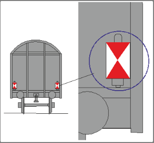

# Signale an Zügen (Zg) [301.1101]

---

# 1. Allgemeines

## Zweck

Die Signale kennzeichnen Züge und auf die freie Strecke übergehende Nebenfahrzeuge mit Kraftantrieb.

---

# 2. Signal Zg 1 – Spitzensignal

## (1) Bedeutung

**Kennzeichnung der Zugspitze.**

## (2) Beschreibung

Tageszeichen: Kein besonderes Signal.

Nachtzeichen:

### a) Signal Zg 1a

Vorn am ersten Fahrzeug, wenn dieses ein Triebfahrzeug oder Steuerwagen ist, drei weiße Lichter in Form eines A (Dreilicht-Spitzensignal).

### b) Signal Zg 1b

Vorn am ersten Fahrzeug, wenn dieses nicht ein Triebfahrzeug oder Steuerwagen ist, zwei weiße Lichter in gleicher Höhe.

## (3) nachgeschobene Züge

Bei nachgeschobenen Zügen trägt auch das Schiebetriebfahrzeug das Spitzensignal, sofern es nicht mit dem Zug gekuppelt ist.

## (4) Nachtzeichen bei Tage

Die Nachtzeichen sind auch bei Tage zu führen.

## (5) Nebenfahrzeuge

Nebenfahrzeuge, an denen wegen ihrer niedrigen Bauart das obere Licht des
Signals Zg 1a nicht angebracht werden kann, führen das Signal Zg 1b).

---

# 3. Signal Zg 2 – Schlusssignal

## (1) Bedeutung

**Kennzeichnung des Zugschlusses.**

## (2) Beschreibung

Am letzten Fahrzeug zwei rote Lichter

oder

zwei rechteckige reflektierende Schilder mit weißen Dreiecken seitlich und je
einem roten Dreieck oben und unten, die mit ihren Spitzen sich in der Mitte
des Schildes berühren. Die roten Lichter dürfen blinken.

## (3) Sichtbarkeit

Das Schlusssignal braucht nur von hinten sichtbar zu sein.

## (4) Anordnung

Die Zeichen müssen in gleicher Höhe angeordnet sein.

## (5)

(bleibt frei)

## (6) Elektrisches Signal

Wenn zwei rote Lichter gezeigt werden können, dürfen andere Zeichen nicht
verwendet werden.

## (7)

Der Infrastrukturunternehmer bestimmt, auf welchen Strecken die Züge zwei
rote Lichter führen müssen.

### örtliche Zusätze

Bei der DB Netz AG sind die betreffenden Strecken in örtlichen Zusätzen bekannt gegeben.

## (8)

(bleibt frei)

## (9) Tunnel

Auf Strecken mit Tunneln sind die zwei roten Lichter zu führen, wenn es der
Infrastrukturunternehmer bestimmt.

### örtliche Zusätze

Bei der DB Netz AG ist die Bestimmung in örtlichen Zusätzen bekannt gegeben.

## (10) nachgeschobene Züge

Bei nachgeschobenen Zügen trägt das letzte Fahrzeug vor dem Schiebetriebfahrzeug das Schlusssignal, wenn das Schiebetriebfahrzeug nicht mit dem
Zug gekuppelt ist.

Das nicht mit dem Zug gekuppelte Schiebetriebfahrzeug selbst – bei zweien
das hintere – trägt auch das Schlusssignal.
